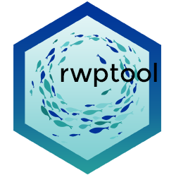

<!-- README.md is generated from README.Rmd. Please edit that file and click on Knit button at the end. -->

```{r, include = FALSE}
knitr::opts_chunk$set(
  collapse = TRUE,
  comment = "#>",
  fig.path = "man/figures/README-",
  out.width = "100%"
)
options(tibble.print_min = 5, tibble.print_max = 5)
```

# rwptool R package <a href='https://ob7-ird.github.io/rwptool'></a>

<!-- badges: start -->
[](https://www.tidyverse.org/lifecycle/#experimental)
[](https://github.com/OB7-IRD/acdc/actions)
[](https://CRAN.R-project.org/package=rwptool)
<!-- badges: end -->

***Regional Work Plans Tool***

## Warning
Package and documentation still in construction !

## Overview

R toolbox package for the EU Regional Work Plans development.

## Installation

```{r, eval = FALSE}
devtools::install_github("https://github.com/OB7-IRD/rwptool",
                         INSTALL_opts=c("--no-multiarch"))
```

### Development version

To get a bug fix or to use a feature from the development version, you can install the development version of rwptool from GitHub.

```{r, eval = FALSE}
devtools::install_github("https://github.com/OB7-IRD/rwptool",
                         ref = "development",
                         INSTALL_opts=c("--no-multiarch"))
```

## Cheatsheet

Working in progress for this section. Be patient.

## Usage

```{r, message = FALSE}
library(rwptool)
# Next steps example will be added later
```

## Getting help

If you encounter a clear bug, please file an issue with a minimal reproducible example on [GitHub issues page](https://github.com/OB7-IRD/rwptool/issues). This link is also available if you have any questions and improvement propositions.

## References

Working in progress for this section.
